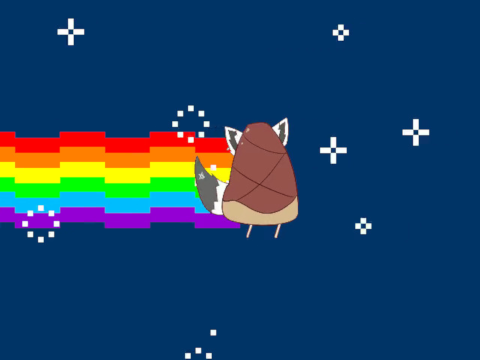

# おるやんけ (nyancat oruyanke)

Nyancat oruyanke is written in Processing.  
If the cartoon character in the above image don't look like cat, you're right.  
It is called  "[Oruyanke](https://twitter.com/shirakamifubuki/status/1032179742152130562)" or "[Takenokon](https://twitter.com/tsumugi_kurama/status/1035454476306472962)" that combine fox with bamboo shoot.  
Did you mean: konfox?

## Usage
1. Download [Processing](https://processing.org/download/) and this project.
2. Execute processing.exe and Open nyancat.pde file.
3. Click run button.

If you want to Change Oruyanke image, please rewrite "oruyanke_anime0000 ~ 0003.gif" file.

## License and Reference.
- [MIT](LICENSE)
- [Nyan Cat [original]](https://www.youtube.com/watch?v=QH2-TGUlwu4)
- [白上フブキ](https://twitter.com/shirakamifubuki)
